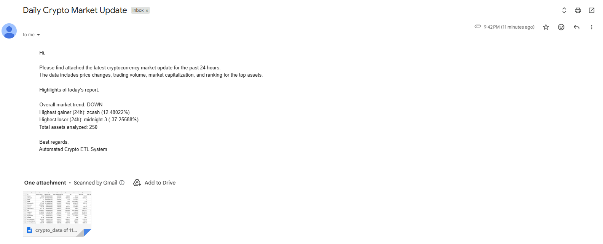

# Daily Crypto Market ETL & Email Automation (CoinGecko API)



This project is a fully automated Python ETL pipeline that fetches cryptocurrency market data from the CoinGecko API, processes important metrics (top gainer, top loser, trend direction, etc.), saves the dataset as a CSV file, and sends the file directly to your email inbox every morning at 08:00 AM. Once started, the automation runs daily without any manual input.

---

## Project Overview

This automation performs 3 main tasks:

### **1. Extract**
Fetches the top 250 cryptocurrencies from CoinGecko’s market API.

### **2. Transform**
Cleans and processes the dataset, generating daily highlights:

- Overall 24h market trend (UP / DOWN / NEUTRAL)
- Top gainer
- Top loser
- Total assets analyzed

### **3. Load / Notify**
Saves the dataset as a timestamped CSV file and emails it to the configured recipient.

The script uses a scheduler to automatically execute the workflow every day at **08:00 AM**.

---

## How the Scheduler Works

The script runs continuously in the background.  
Every 15 seconds it checks:  
If YES → It executes the entire ETL + email process once for that day.

---

## Environment Variables (.env)

This project uses a `.env` file for sensitive credentials.  
**This file is not included in the repository** for security reasons.

Create your own `.env` file with:  
SENDER_EMAIL=your_email@gmail.com  
PASSWORD=your_email_password  
RECEIVER_EMAIL=recipient@gmail.com  


---

# Python Script

```python
# Task 1. Downloading the datasets from coingecko
# Task 2. Sending the email
# Task 3. Scheduling the task at a certain time

import smtplib
from email.mime.multipart import MIMEMultipart
from email.mime.text import MIMEText
from email.mime.base import MIMEBase
import email.encoders

from dotenv import load_dotenv
import os

import pandas as pd
from datetime import datetime
import requests
import schedule
import time

load_dotenv()
sender = os.getenv("SENDER_EMAIL")
pswd = os.getenv("PASSWORD")
receiver = os.getenv("RECEIVER_EMAIL")


def send_email(subject, content, file_name):

    smtp_server = 'smtp.gmail.com'
    port = 587
    sender_email = sender
    password = pswd
    receiver_email = receiver

    # composing the mail
    message = MIMEMultipart()
    message['From'] = sender
    message['To'] = receiver
    message['Subject'] = subject

    # attaching the content of the email
    message.attach(MIMEText(content, 'plain'))

    # attaching the csv file
    with open(file_name, "rb") as attachment:
        part = MIMEBase('application', 'octet-stream')
        part.set_payload(attachment.read())
        email.encoders.encode_base64(part)
        part.add_header('Content-Disposition', f'attachment; filename={file_name}')
        message.attach(part)

    # start server
    try:
        server = smtplib.SMTP(smtp_server, port)
        server.starttls()
        server.login(sender_email, password)

        # sending mail
        server.sendmail(sender_email, receiver_email, message.as_string())
        print("Email sent successfully!")

    except smtplib.SMTPAuthenticationError as e:
        print(f"Connection Failed\nError Code {e}")


def get_crypto_data():

    url = 'https://api.coingecko.com/api/v3/coins/markets'
    param = {
        'vs_currency': 'usd',
        'order': 'market_cap_desc',
        'per_page': 250,
        'page': 1,
    }

    response = requests.get(url, params=param)
    if response.status_code == 200:
        print('Connection Successful\nGetting the data...')
        data = response.json()

        df = pd.DataFrame(data)

        # selecting only the needed columns
        df = df[[
            'id', 'current_price', 'market_cap', 'price_change_percentage_24h',
            'ath', 'atl', 'high_24h', 'low_24h'
        ]]

        today = datetime.today().strftime('%d-%m-%Y %H-%M-%S')
        df['timestamp'] = today

        # HIGHLIGHTS

        # 1. Market trend
        avg_change = df['price_change_percentage_24h'].mean()
        if avg_change > 0:
            trend_direction = 'UP'
        elif avg_change < 0:
            trend_direction = 'DOWN'
        else:
            trend_direction = 'NEUTRAL'

        # 2. Top gainer
        top_gainer = df.loc[df['price_change_percentage_24h'].idxmax()]
        top_gainer_name = top_gainer['id']
        top_gainer_change = top_gainer['price_change_percentage_24h']

        # 3. Top loser
        top_loser = df.loc[df['price_change_percentage_24h'].idxmin()]
        top_loser_name = top_loser['id']
        top_loser_change = top_loser['price_change_percentage_24h']

        # 4. Total assets
        total_assets = len(df)

        # saving the file
        file_name = f'crypto_data of {today}.csv'
        df.to_csv(file_name, index=False)
        print(f"Data saved successfully as {file_name}!")

        # email content
        subject = "Daily Crypto Market Update"
        content = f"""
            Hi,

            Please find attached the latest cryptocurrency market update for the past 24 hours.
            The data includes price changes, trading volume, market capitalization, and ranking for the top assets.

            Highlights of today's report:

            Overall market trend: {trend_direction}
            Highest gainer (24h): {top_gainer_name} ({top_gainer_change}%)
            Highest loser (24h): {top_loser_name} ({top_loser_change}%)
            Total assets analyzed: {total_assets}

            Best regards,
            Automated Crypto ETL System
            """

        send_email(subject, content, file_name)

    else:
        print(f"Connection Failed\nError Code {response.status_code}")


if __name__ == '__main__':
    # scheduling the task at 8 AM every day
    schedule.every().day.at('08:00').do(get_crypto_data)

    while True:
        schedule.run_pending()
        time.sleep(15)
```

### Conclusion

This project demonstrates:
- API extraction
- Data cleaning & transformation
- Automated email reporting
- Daily scheduling with Python
- Secure handling of credentials (.env best practices)


