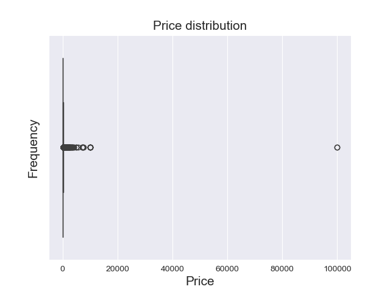

## Projects Overview

### 1. **Exploratory Data Analysis (EDA)**


This project focuses on **exploring and understanding datasets** using Python libraries like Pandas, NumPy, Matplotlib, and Seaborn.  

**Key Highlights:**
- Cleaned and preprocessed raw datasets.  
- Handled missing values and duplicates.  
- Performed **univariate and bi-variable analysis**.  
- Created visualizations like boxplots, histograms, scatterplots, pairplots, and correlation heatmaps.  
- Calculated metrics such as **price per bed** and average price per neighborhood (example with Airbnb dataset).  

**Folder:** [`EDA`](EDA/)  
**Files included:** cleaned datasets, plots, Jupyter notebooks, and the Python scripts.

---

### 2. **Daily Crypto Market ETL & Email Automation**


A fully automated **ETL pipeline** that fetches cryptocurrency market data from the **CoinGecko API**, processes key metrics, saves the dataset as a CSV, and sends it via email every day at 08:00 AM.  

**Key Features:**
- **Extract:** Fetch top 250 cryptocurrencies from CoinGecko API.  
- **Transform:** Calculate daily highlights such as top gainer, top loser, trend direction, and total assets.  
- **Load / Notify:** Save dataset as CSV and email it automatically.  
- Uses a scheduler for fully **automated daily execution**.  
- Secure handling of credentials using `.env` files.  

**Folder:** [`Crypto`](Crypto/)  
**Files included:** Python script, sample CSV output, `.env.example`.

---

### 3. **Data Cleaning & ETL Utility**


A **reusable Python function** to clean datasets (CSV or Excel) for analysis or further processing.  

**Capabilities:**
- Detect file type (`.csv` or `.xlsx`) and read it automatically.  
- Identify and save duplicate rows for logging.  
- Remove duplicates and handle missing values:
  - Replace numeric missing values with column mean.  
  - Drop rows with missing object/string values.  
- Save the cleaned dataset as a new CSV file.  
- Fully reusable for any dataset by calling the function.  

**Folder:** [`ETL`](ETL/)  
**Files included:** Python script, sample input files, cleaned dataset outputs.

---

## Common Libraries Used
- `pandas`, `numpy` – data manipulation and analysis  
- `matplotlib`, `seaborn` – data visualization  
- `requests` – API calls  
- `smtplib`, `email` – sending automated emails  
- `schedule` – task scheduling  
- `os`, `time`, `random` – system operations and delays  
- `dotenv` – secure environment variable management  

---

## How to Use
1. Clone the repository:  
```bash
git clone https://github.com/prek-g/python-EDA-ETL-API.git

Conclusion

This portfolio demonstrates my ability to:
- Analyze and visualize data effectively (EDA project).
- Build reusable data cleaning utilities (ETL project).
- Automate data extraction, transformation, and reporting workflows (Crypto ETL project).
- Integrate Python with APIs, email systems, and scheduling for real-world automation.


